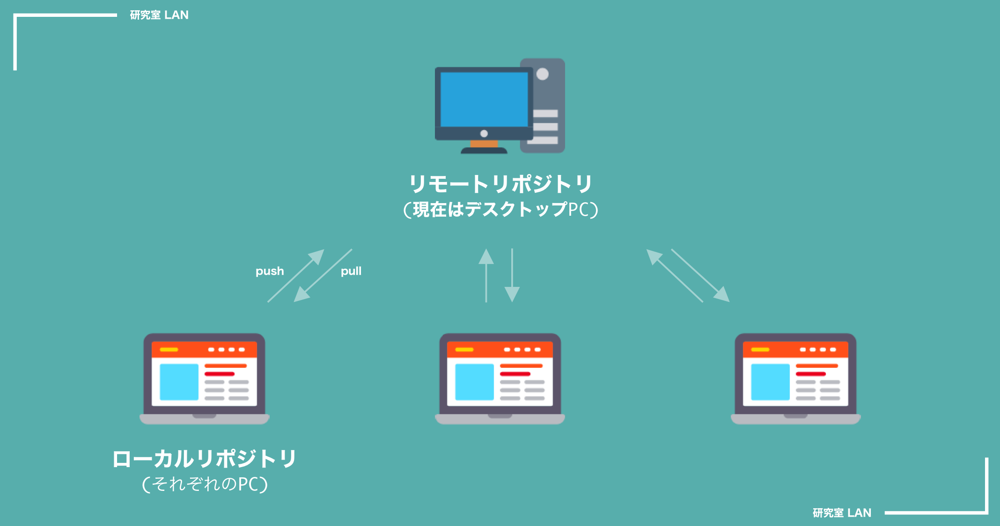
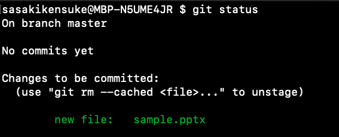
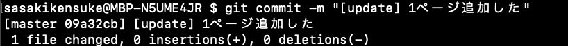
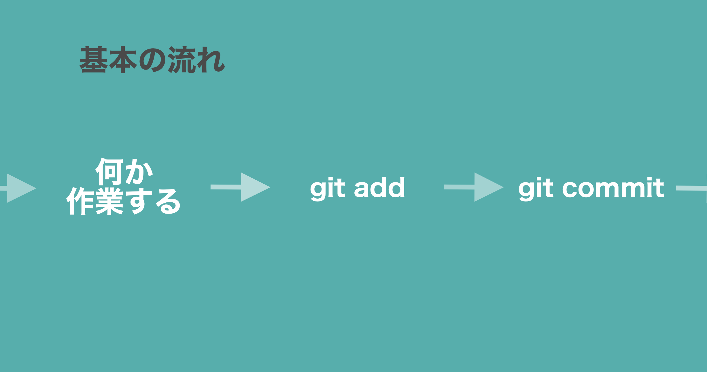
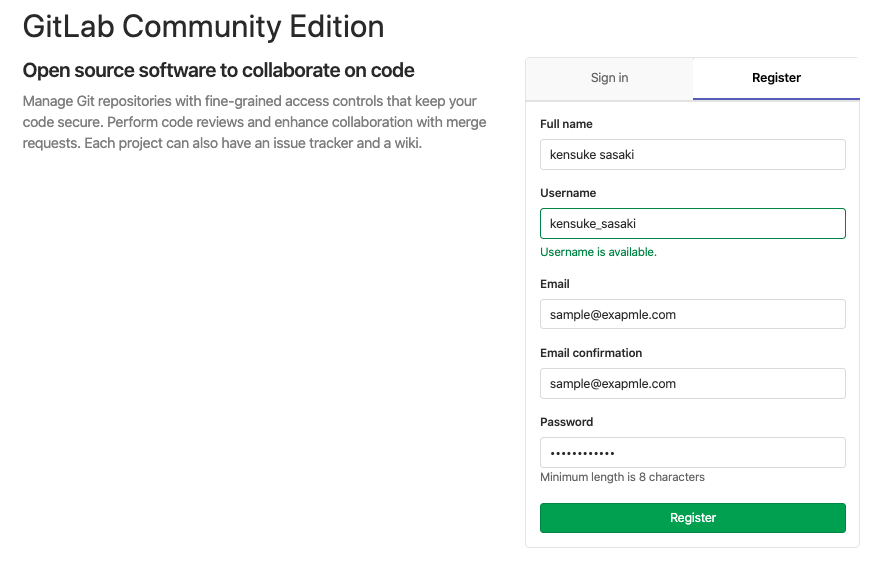
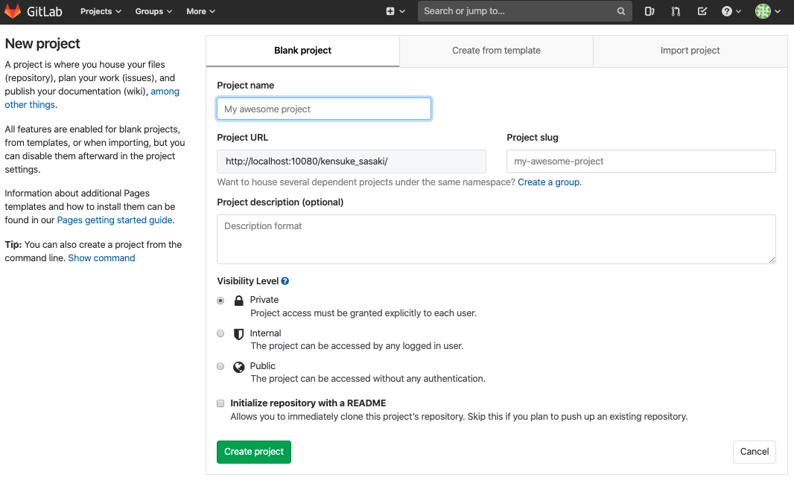
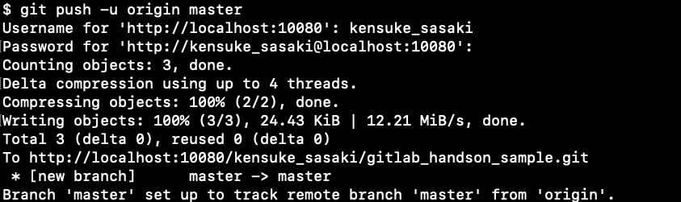
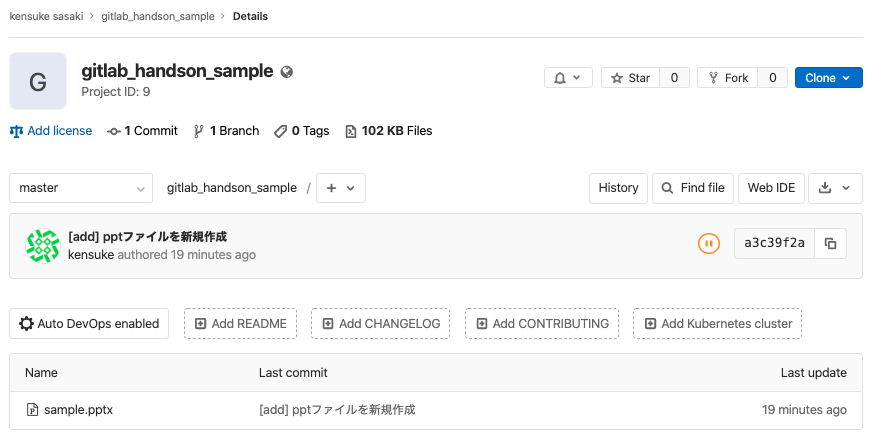
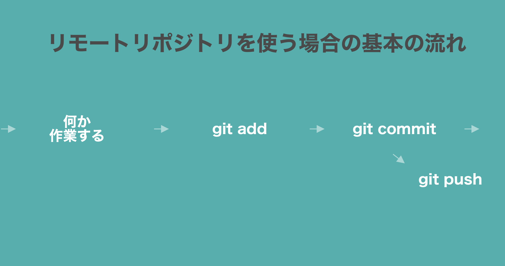

<!-- size: 4:3 -->

<style>
    @font-face
    {
        font-family: monaco;
        src: url('./assets/monaco.ttf')
    }
    section {
        background:#F5BF6A;
        color:#333333;
        font-family: 'monaco' 'Monaco';
        justify-content: flex-start;
    }
    h1{
        color:#060000;
    }
    h5 {
        background: #333333;
        color: #F1F0EE;
        text-align: center;
        padding: 5px 0px 5px 0px;
        width: 40%;
    }
    p{
        color:#060000;
    }
    li {
        list-style-type: none;
    }
    li:before {
        content: '';
        width: 6px;
        height: 6px;
        display: inline-block;
        border-radius: 100%;
        background: #060000;
        position: relative;
        left: -15px;
        top: -5px;
    }
    table {
        padding: inherit;
    }
    th {
        background: #D5EBDC;
        color: #2A2B25;
        font-size: 18px;
    }
    td{
        color: #2A2B25;
        font-size: 14px;
    }
</style>

<style scoped>
    section {
        justify-content: center;
    }
    p{
        text-align: center;
        margin-top: 10%;
        font-size: 18px;
    }
</style>

# Git/Gitlab Hands-on

- 目標
- Git、Gitlabとは
- 1人でGit
- (2人でGit)

2019.12.09

---

# 目標

## 1. Gitをさわったことがある状態にする
## 2. 今後、Gitでコードを管理するようになる

---

<style scoped>
    h6 {
        margin-bottom:0px;
        margin-top:15px;
        color: #333333;
    }
    li {
        margin-bottom: 0px;
        margin-top: 0px;
    }
</style>

# 今日やること

###### 1. Git/Gitlabのかんたんな説明
###### 2. 用意するもの確認
###### 3. 1人でコードを管理してみる
- init → add → commit
- 一個前までもどしてみる
- プロジェクトをつくってみる
- remoteに保存(push)する


###### 4. 2人でコードを管理してみる(いつか時間があれば)
- プロジェクトを作ってmemberを加えてみる
- 共同編集する
    

---

<style scoped>
    li {
        font-size: 20px;
    }
    ul {
        margin-bottom: 0px;
    }
    h2 {
        text-align: center;
        margin-top: 20px;
    }
</style>

# Gitとは

- ソースコードの変更履歴を記録・追跡するためのシステム
- リーナス・トーバルズによって開発された(2005年)

## 

---

## Gitを使うとこんないいことある

- 「さっきまで動いてたのに」みたいな時にその時もどまでもどれる
- `ゼミ資料ver1_最新(修正済み).pptx`みたいな命名から解放される

## Gitlab(Github)を使うとこんないいことある

- コードを外部サーバーに保存できる(手元のPCが壊れても大丈夫)
- 複数人でいい感じに共同作業できる

---

<style scoped>
    table {
        padding-top: 3%;
        padding-bottom: 3%;
    }
</style>

# Gitlabとは

- Githubにインスパイアされて作られたGithubみたいなやつ
- 今研究室で使ってるのは `Gitlab CE` の方
    - Windows PCがアプリケーションのサーバーになっていて、そのPCのフォルダにコードとかが保存されていく感じ

|種類|概要|
|--|--|
|Gitlab|Githubと同様、Gitlab Incの提供するサーバーにコードを保管するタイプのやつ|
|Gitlab Community Edition|オープンソース、自前でサーバーを用意するので、自分たちのところで完結する|

---

# 1人でGit

## 用意するもの3つ

- terminal
- powerpoint
- Finder

##### COMMAND
の次に書いてるコマンドを実行してください

---

# 1人でGit

- pptファイルをgitでバージョン管理してみる

流れ

```
0. フォルダ作る
1. フォルダのgitを初期化する
2. pptファイルを作成
3. pptファイルを管理対象にする
4. その時点を保存する

5. 編集 → 保存 → 編集 → 保存
```

---

# 1人でGit

```
0. フォルダ作る
```

<br>
フォルダを作ってそのフォルダまで移動する

##### COMMAND

```
$ mkdir gitlab_handson_sample
$ cd gitlab_handson_sample
```
もしくは
```
$ mkdir gitlab_handson_sample; cd $_
```

---

# 1人でGit

```
1. gitを初期化する
```

<br>
以下のコマンドでローカルリポジトリを新規作成する

→ `.git`ファイルが作成される

##### COMMAND

```
$ git init
```
以下のような表示がでればok
> Initialized empty Git repository in <path>

---

# 1人でGit

```
2. pptファイルを作成
```

今のディレクトリに`sample.pptx`を作成する
1ページ目だけ、適当に作っておいてください

##### 作業

```
手元でパワーポイント開いて、今いるディレクトリに新規保存
```
- `gitlab_handson_sample/sample.pptx`

---

# 1人でGit

```
3. pptファイルを管理対象にする
```

管理するファイルに追加(add)するイメージ

##### COMMAND

```
$ git add sample.pptx
```

---

<style scoped>
    h2 {
        text-align: center;
        margin-top: 20px;
    }
</style>
# 1人でGit

```
3. pptファイルを管理対象にする
```

状態を確認してみる
```
$ git status
```

## 


---

# 1人でGit

```
4. その時点を保存する
```

その前にusernameとmailをなんとなく入力する(おそらくgitlabに登録した時のやつでok、違っても大丈夫そう)

##### COMMAND

```
$ git config --global user.name "<Your Name>"
$ git config --global user.email <your-address@example.com"
```

```
$ git config --global user.name "kensuke"
$ git config --global user.email sample@example.com
```

---

<style>
    a {
        font-size: 20px;
        text-align: right;
    }
</style>

# 1人でGit

```
4. その時点を保存する
```

##### COMMAND

例)
```
$ git commit -m "[add] pptファイルを新規作成"
```

## 

[Qiita:コミットメッセージの書き方](https://qiita.com/itosho/items/9565c6ad2ffc24c09364)

---

# 1人でGit

- ここまでで以下の`0~4`が完了

```
0. フォルダ作る
1. フォルダのgitを初期化する
2. pptファイルを作成
3. pptファイルを管理対象にする
4. その時点を保存する
```

ここまで終わったら、`5`を繰り返していく感じ

```
5. 編集 → 保存 → 編集 → 保存
```

---

少しやってみる

---
<style scoped>
    h2 {
        text-align: center;
    }
</style>

# 1人でGit

```
5.1 pptファイルに1ページ追加する
```

やってみる

##### 作業

```
1ページ追加
```


---

# 1人でGit

```
5.2 ファイルを管理対象に追加する
```

やってみる

##### COMMAND

```
$ git add sample.pptx
```

---

# 1人でGit

```
5.3 その時点を保存する
```

やってみる

##### COMMAND

```
git commit -m "[update] ページ追加した"
```

## 

---

さらに変更してみる

---

# 1人でGit

```
5.1 もう1ページ追加
```

##### 作業

```
さらに1ページ追加
```

## 


---

# 1人でGit

```
4. git add <file>
```

ファイルを管理下に追加する

##### COMMAND

```
$ git add sample.pptx
```

---

# 1人でGit

```
5. `git commit -m "<メッセージ>"
```

その時点を保存する

```
$ git commit -m "[update] もう1ページ追加した"
```

---

<style scoped>
    h2 {
        margin-top: 0px;
    }
</style>

# 1人でGit

以下の流れを繰り返してその時々の変更を保存していく

## 

---

# 1人でGit

- 諸事情で、1ページ目追加したときまで戻りたくなった
- 戻るための手順

```
0. git log でハッシュを確認
1. git reset でもどる
```

---

<style scoped>
    h2 {
        text-align: center;
    }
</style>

# 1人でGit

```
0. git log でハッシュを確認
```

以下のcommandでcommit(ある時点)のハッシュが得られる
最初のページを加えたcommitのハッシュは`09a32cb`
さらにもう1ページ追加したcommitのハッシュは`4b766f5`

##### COMMAND

```
$ git log --oneline
```

## 

---

<style scoped>
    h2 {
        margin-top: 0px;
        margin-bottom: 0px;
        text-align: center;
    }
</style>

# 1人でGit

```
1. git reset でもどる
```

ハッシュを指定して戻る

##### COMMAND

```
$ git reset --hard 09a32cb
```

## 

- pptファイルをみると全部で2ページに戻ってる

---


ここまで理解できると、ローカルPCでバージョン管理できるようになる
→ ここから、リモートリポジトリにコードを保存してみる

---

# 1人でGit

- リモートリポジトリにコードを保存する

```
0. プロジェクトを作成する
1. リモートリポジトリを登録する
2. リモートにコードを保存する(push)
```

---

<style scoped>
    h6 {
        text-align: center;
        font-size: 250px;
    }
</style>

# 1人でGit

```
0. プロジェクトを作成する
```

###### 実演

---

<style scoped>
    h2 {
        text-align: center;
    }
</style>

# 1人でGit

```
0. プロジェクトを作成する
```
- その前に登録

## 


---

<style scoped>
    h2 {
        text-align: center;
    }
</style>

# 1人でGit

```
0. プロジェクトを作成する
```
- `project name`はフォルダの名前で

## 

---

# 1人でGit

```
1. リモートリポジトリを登録する
```
##### COMMAND

```
$ git remote add origin http://192.168.100.4:10080/<user-name>/<project-name>.git
```
例)


---

# 1人でGit

```
2. リモートにコードを保存する(push)
```

##### COMMAND

```
$ git push -u origin master
```




---

<style scoped>
    h2 {
        text-align: center;
    }
</style>

# 1人でGit

```
2. リモートにコードを保存する(push)
```
- リモートサーバーにコードが保存される

## 


---

<style scoped>
    h2 {
        text-align: center;
    }
</style>

# 1人でGit

- 区切りのいいところでremoteにpushして保存していく

## 


---

# 2人でGit

- またいつか

---

# 1人でGit まとめ

- 作業 → `git add` → `git commit` のサイクルを続ける
- 区切りがきたら、`git push origin master`でリモートにpush
- 上の作業をしながら分析・開発すると、¥
    - PCが壊れてもバックアップできる
    - ある時点まで戻れる
        - `filename_最新版ver1(確認済み).pptx` とかから解放される
    
---

ここから参考資料

---

<style scoped>
    table {
        width: 100%;
        padding: 0;
        align: center;
    }
    th, td {
        width: 50%;
    }
</style>

# よく使うコマンドまとめ

### ファイル操作関連 その1

|command|用途|
|--|--|
|`ls <folder-name>`|フォルダの中にあるものを表示|
|`ls -l`|今のディレクトリにあるものを縦に表示(見やすい)|
|`cd <folder-name>`|フォルダまで移動|
|`cd ..`|1つ下の階層まで移動|
|`cd ../..`|2つ下の階層まで移動|
|`mkdir <folder-name>`|フォルダを作成|

- terminalでは、`.`は今の位置、`..`は一個前

---

<style scoped>
    table {
        width: 100%;
        padding: 0;
    }
    th, td {
        width: 50%;
    }
</style>

# よく使うコマンドまとめ

### ファイル操作関連 その2

|command|用途|
|--|--|
|`touch <file-name>`|ファイルを作成|
|`rm <file-name>`|ファイルを削除|
|`rm -r <filder-name>`|フォルダを削除|


---

<style scoped>
    table {
        width: 100%;
        padding: 0;
        margin-top: 0;
    }
    th, td {
        width: 50%;
    }
</style>

# よく使うコマンドまとめ

### git 関連

|command|用途|
|--|--|
|`git init`|フォルダのgit repositoryを初期化する|
|`git add <file-name>`|ファイルをgit管理下に追加する|
|`git add .`|今のディレクトリにある全部を管理下にする|
|`git commit -m "<message>"`|その時点を保存する|
|`git log --oneline`|commitログを表示する|
|`git reset -hard <commit-id>`|commit idの時点まで戻る|
|`git reset -soft <commit-id>`|commitする前まで戻る(変更自体は消えない)|
