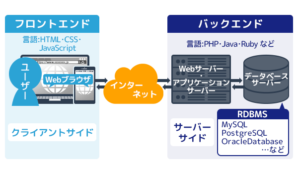

<!-- size: 4:3 -->

<style>
    section {
        background: #181818;
        color:#FFFF;
        font-family: 'Noto Sans CJK JP';
        justify-content: flex-start;
    }
    h1{
        color:#D5EBDC;
    }
    p{
        color:#D5EBDC;
    }
    li {
        list-style-type: none;
    }
    li:before {
        content: '';
        width: 6px;
        height: 6px;
        display: inline-block;
        border-radius: 100%;
        background: grey;
        position: relative;
        left: -15px;
        top: -5px;
    }
    table {
    padding: inherit;
    }
    th {
        background: #D5EBDC;
        color: #2A2B25;
        font-size: 18px;
    }
    td{
        color: #2A2B25;
        font-size: 14px;
    }
</style>

<style scoped>
    section {
        justify-content: center;
    }
    p{
        text-align: center;
        margin-top: 10%;
        font-size: 18px;
    }
</style>

# Dash Hands-on

- Hands-onの目的
- Dashとは
- 今日作るもの

2019.11.06

---

# Hands-onの目的

## その1

- アプリを作ったことがある状態にすること

---
<style scoped>
h6{
    font-size: 18px;
    text-align: right;
}
</style>
# Hands-onの目的

## その2

- データ分析の見せ方の選択肢を増やす
  - PowerPointのスライド
  - wordのレポート
  - application ← new

###### ※ アプリにして見せると話を聞いてくれる現場もあるらしい <br>(2019.10, 某広告代理店の人)

---

<style scoped>
    h2{
        text-align: center;
    }
    h6{
        font-size: 18px;
        text-align: right;
    }
</style>

# Dashとは

## 

- PythonのWebアプリケーションフレームワークの一つ
    - pythonだけで完結する(Rでもかけるらしい)
    - no Javascript、HTML、CSS
    - Dash自体はFlask、Pl   otly.js、React.jsでできてる

###### ※ フレームワーク : 枠組み、骨組み、組織、体制

---

# Dashとは

- Dashで作られたsample
    - [Dash App Gallery](https://dash-gallery.plotly.host/Portal/)


---

<style scoped>
    h2 {
        text-align: center;
    }
    h6{
        font-size: 18px;
        text-align: right;
    }
</style>

# Dashとは

- 一般的なアプリに必要なもの
    - アプリの外側のファイル (html、js、css) 
    - 内部処理のファイル (py)

## 
###### (https://www.kagoya.jp/howto/webhomepage/webapplication/)


---

<style scoped>
    pre {
        background: #211716;
        font-size: 14px;
    }
</style>

# Dashとは

- Dash appに必要なもの
    - 基本Pythonファイル一つだけ

app.py

```python

import dash

app = dash.Dash(__name__)

app.layout = html.Div(
    # アプリの見た目を記述する
)

# 入力と出力を指定する
@app.callback(
    Output(component_id='my-div', component_property='children'),
    [Input(component_id='my-id', component_property='value')]
)
# 処理を記述する
def update_output(input_value):
    return "inputに応じて返す内容"

if __name__ == '__main__':
    app.run_server(debug=True)
```

---

<style scoped>
    section {
        background: #90C0D8;
    }
</style>

# :end:

---
<style scoped>
    h2 {
        text-align: center;
    }
</style>

# 今日作るもの

- csvファイルをinputして機械学習するアプリ

## 

---

<style scoped>
    table{
        padding-top: 1%;
    }
</style>

# 用いるデータについて

- 参考文献：[第二版] Python機械学習プログラミング
    - [達人データサイエンティストによる理論と実践](https://raw.githubusercontent.com/rasbt/python-machine-learning-book-2nd-edition/master/code/ch10/housing.data.txt)

| 列名 | 意味 |
| :--- | :--- |
| CRIM | 犯罪発生率(人口単位) |
| ZN | 25,000平方フィート以上の住宅区画の割合 |
| INDUS | 非小売業の土地面積の割合(人口単位) |
| CHAS | チャールズ川沿いかどうか(チャールズ川沿いであれば1, そうでなければ0) |
| NOX | 窒素酸化物の濃度(pphm単位) |
| RM | 一戸あたりの平均部屋数 |
| AGE | 1940年よりも前に建てられた家屋の割合 |
| DIS | ボストンの主な5つの雇用圏までの重み付き距離 |
| RAD | 幹線道路へのアクセス指数 |
| TAX | 10,000ドルあたりの所得税率 |
| PTRATIO | 教師一人当たりの生徒の数(人口単位) |
| B | 1000(Bk-0.63)<sup>2</sup>として計算(Bkはアフリカ系アメリカ人居住者の割合(人口単位)) |
| LSTAT | 低所得者の割合 |
| MEDV(=ターゲット変数) | 住宅価格の中央値(単位1,000ドル) |

---

<style scoped>
    th {
        font-size: 18px;
    }
    td{
        font-size: 14px;
    }
</style>

# 今日のタイムテーブル

|時間|やること|
|:--|:--|
| 16:00~16:15 | 最初の説明 |
|---|
| 16:15~16:25 | タイトルとアップロードの部分だけ作って、cssでいい感じに表示させてみる |
| 16:25~16:40 | 単純な線形モデルを作り、残渣プロットとスコアを表示させる |
| 16:40~16:55 | モデルを選択するドロップダウンを作って、選択したモデルに応じて出力結果が変わるような動的なページを作る |
| 16:55~17:10 | 休憩！ |
| 17:10~17:25 | ファイルをアップロードし、データフレームとして表示させる (アップロードとデータの学習は別々で行う) |
| 17:25~17:40 | 読み込んだデータをtrainデータとして読み込むように連携(Callback)させる |
